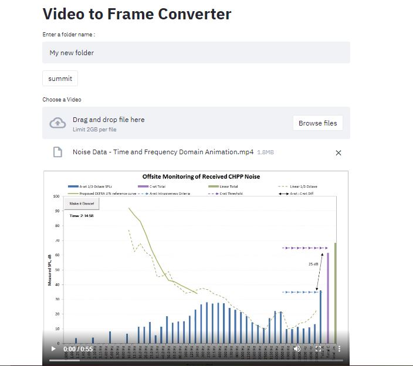

# Video-to-frame-converter

A simple App that converts video's to frame and saves the frame in choice of folder

#### App

 
  <kbd>
    
  </kbd>

## Running
Run with `Streamlit run app.py`

## App was made with Streamlit [streamlit](https://www.streamlit.io/)

